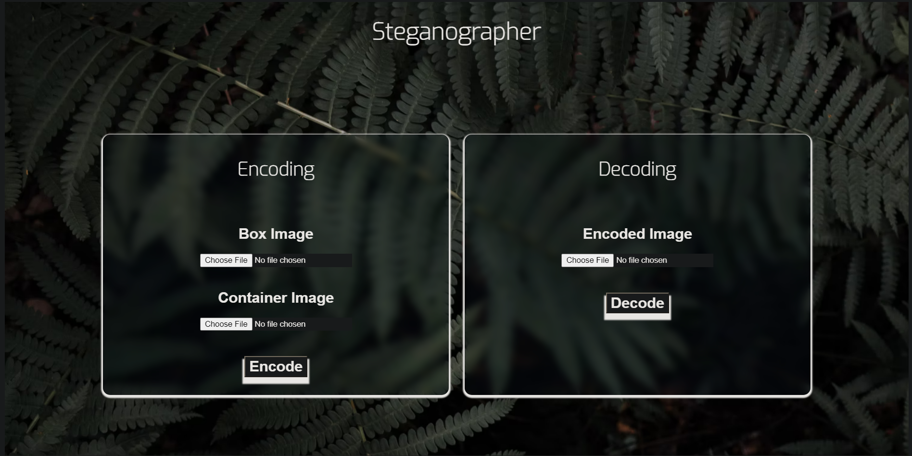

<div align="center"> 
  

> This is a web based application which enables users to hide 1 image into another without destroying any of the 2 images.
> Also, to seperate out hidden image, we have decryption alogorithm also.
> Live demo [_here_](https://gameostash.herokuapp.com/).

- Provide general information about your project here.<br/><br/>
- Many a times we want to hide a particular image but due to security issues we are not able to do so. Due to this fact(and yes we have lot's of images we don't want to show and neither want to store somewhere), hiding it seemed a better option.<br/><br/>
- We created this project to learn how tasks and other manupulations could be done without paying much attention to dependencies and creating containers to ship our product<br/><br/><br/>

<br/><br/>

- Django - v3.7.1
- Postgresql
- Pillow for image manupulation - v8.3.1
  <br/><br/>

<br/><br/>

- Hide 1 image inside another.
- Retrieve hidden image back without compromising with quality of the 2 images used.<br/><br/>

<br/><br/>



<strong><h2 style="color:#364547">Setup for running it Locally</h2></strong>

To run this project, follow the steps listed below.

> Install Python v3.7 or above from [_here_](https://www.python.org/downloads/release/python-370/)

> Now once you have install python, create virtual enviroment or activate an existing one.
> To create a new virtual enviroment, follow the steps:

```
$ pip install virtualenv
```

Now check your installation

```
$ virtualenv --version
```

Create a virtual environment now,

```
$ virtualenv virtualenv_name
```

After this command, a folder named virtualenv_name will be created. You can name anything to it. If you want to create a virtualenv for specific python version, type

```
$ virtualenv -p /usr/bin/python3 virtualenv_name
```

or

```
$ virtualenv -p /usr/bin/python2.7 virtualenv_name
```

Now at last we just need to activate it, using command

```
$ source virtualenv_name/bin/activate
```

Clone this repo

```
git clone https://github.com/GameophileProductions/stegnographer.git
```

`cd stegnographer`

and run

```
pip install -r requirements.txt
```

This will install all the dependencies
<br/><br/>

Run server on port 8000 by using

```
waitress-serve --port=8000 stegnographer.wsgi:application
```

<br/><br/>
<strong><h2 style="color:#364547">Room for Improvement </h2></strong>

- Stability and efficiency of hidding image
- User interface
- Scalability of this app

<br/><br/>
<strong><h2 style="color:#364547">To Do </h2></strong>

- Loading css

<br/><br/>


  <table>
<tr align="center">
 <td>
<!-- Here I am writing my own code -->
Om Mukherjee

<p align="center">

</p>

<p align="center">
<a href = "https://github.com/Oyum2814"></a>
<a href = "https://www.linkedin.com/in/om-mukherjee-b842b9212/">

</a>
</p>
    <strong>Frontend <br/> &<br/>Algorithm Generator<strong>
</td>

<td>
  
Achyut Shukla

<p align="center">

</p>
<p align="center">
<a href = "https://github.com/Achyut-0705"></a>
<a href = "https://www.linkedin.com/in/achyut-shukla-070502/">

</a>
</p>
  <strong>Backend <br/>&<br/> Hosting<strong>
</td>
  
  </table>
</tr>
</div>
  <br>
</div>
